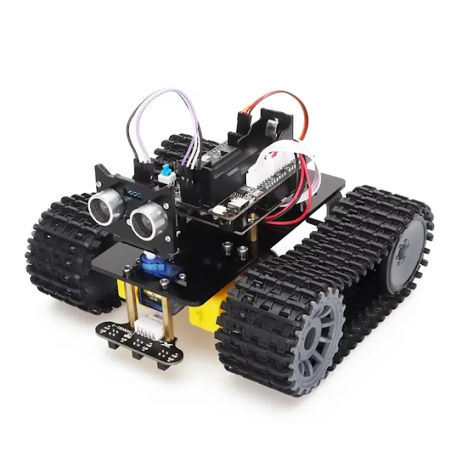

# Tank Robot Project with Ultrasonic Sensor and Servo

This project involves building a tank-style robot equipped with a microcontroller, DC motors, ultrasonic sensor, and a servo motor for obstacle detection and avoidance.

---



## 1. Components Required

| **Component**             | **Quantity** | **Description**                                     |
|---------------------------|--------------|---------------------------------------------------|
| Arduino Uno or ESP32      | 1            | Microcontroller to control the robot              |
| Tank chassis              | 1            | Chassis with tracks and motor mounts             |
| DC motors                 | 2            | For driving the tracks                            |
| Motor driver (L298N/L293D)| 1            | For controlling motor speed and direction         |
| Ultrasonic sensor (HC-SR04)| 1           | For obstacle detection                            |
| Servo motor               | 1            | To rotate the ultrasonic sensor                  |
| Battery pack (6-12V)      | 1            | To power the robot                                |
| Connecting wires          | -            | For circuit connections                           |
| Breadboard (optional)     | 1            | For testing and temporary connections             |
| Screws and nuts           | -            | For securing components                          |
| Jumper cables             | -            | For wiring                                        |

---

## 2. Circuit Diagram

### Pin Connections

| **Component**       | **Arduino/ESP32 Pin** | **Additional Notes**                |
|---------------------|-----------------------|-------------------------------------|
| Motor driver (IN1)  | Digital Pin 2         | Control motor direction             |
| Motor driver (IN2)  | Digital Pin 3         | Control motor direction             |
| Motor driver (IN3)  | Digital Pin 4         | Control motor direction             |
| Motor driver (IN4)  | Digital Pin 5         | Control motor direction             |
| Ultrasonic sensor (Trig) | Digital Pin 9     | Trigger pin for distance measurement|
| Ultrasonic sensor (Echo) | Digital Pin 10    | Echo pin for receiving distance data|
| Servo motor         | Digital Pin 11 (PWM) | Control rotation of the sensor      |
| Battery             | Motor driver VCC     | Power supply for motors             |
| GND (common ground) | Arduino/ESP32 GND    | Connect all grounds together        |

---

## 3. Assembly Steps

1. **Chassis Assembly**:
   - Attach the DC motors to the tank chassis using screws or mounts provided.
   - Fix the tracks securely to the wheels.

2. **Sensor Mounting**:
   - Attach the ultrasonic sensor to the servo motor for rotational scanning.
   - Secure the servo motor on the front of the chassis.

3. **Microcontroller and Driver**:
   - Mount the Arduino/ESP32 and motor driver securely on the chassis.
   - Ensure proper cable management to avoid tangling.

4. **Wiring**:
   - Connect the motors to the motor driver outputs.
   - Wire the ultrasonic sensor and servo motor to the designated pins on the microcontroller.
   - Connect the battery pack to the motor driver and microcontroller.

---

## 4. Programming

Here is the Arduino code for the robot:

```cpp
#include <Servo.h>

Servo servo;
const int trigPin = 9;
const int echoPin = 10;
const int motor1Pin1 = 2;
const int motor1Pin2 = 3;
const int motor2Pin1 = 4;
const int motor2Pin2 = 5;

void setup() {
  pinMode(trigPin, OUTPUT);
  pinMode(echoPin, INPUT);
  pinMode(motor1Pin1, OUTPUT);
  pinMode(motor1Pin2, OUTPUT);
  pinMode(motor2Pin1, OUTPUT);
  pinMode(motor2Pin2, OUTPUT);
  servo.attach(11);
}

void loop() {
  long distance = measureDistance();

  if (distance < 20) {
    stopMotors();
    delay(500);
    turnRight();
    delay(500);
  } else {
    moveForward();
  }
}

long measureDistance() {
  digitalWrite(trigPin, LOW);
  delayMicroseconds(2);
  digitalWrite(trigPin, HIGH);
  delayMicroseconds(10);
  digitalWrite(trigPin, LOW);

  long duration = pulseIn(echoPin, HIGH);
  long distance = duration * 0.034 / 2;
  return distance;
}

void moveForward() {
  digitalWrite(motor1Pin1, HIGH);
  digitalWrite(motor1Pin2, LOW);
  digitalWrite(motor2Pin1, HIGH);
  digitalWrite(motor2Pin2, LOW);
}

void stopMotors() {
  digitalWrite(motor1Pin1, LOW);
  digitalWrite(motor1Pin2, LOW);
  digitalWrite(motor2Pin1, LOW);
  digitalWrite(motor2Pin2, LOW);
}

void turnRight() {
  digitalWrite(motor1Pin1, LOW);
  digitalWrite(motor1Pin2, HIGH);
  digitalWrite(motor2Pin1, HIGH);
  digitalWrite(motor2Pin2, LOW);
}
```

---

## 5. Testing and Debugging

1. Test motor connections by running basic motor control code.
2. Verify ultrasonic sensor readings using the serial monitor.
3. Debug and fine-tune obstacle avoidance logic.

---

## 6. Uploading to GitHub

1. Create a new repository on GitHub.
2. Add the following structure:

```
TankRobotProject/
├── CircuitDiagram.png
├── Code/
│   └── TankRobot.ino
├── README.md
├── ComponentsList.txt
└── Images/
    └── AssembledRobot.jpg
```

3. Push the project files:
   ```bash
   git init
   git add .
   git commit -m "Initial commit"
   git branch -M main
   git remote add origin <your-repo-link>
   git push -u origin main
   ```

Let me know if you need a hand drawing the circuit diagram or any additional details!
